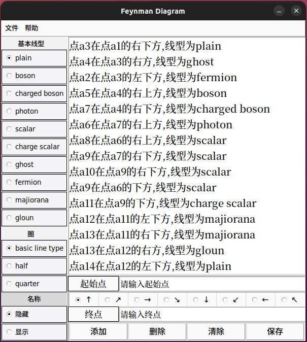
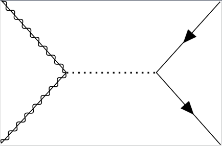
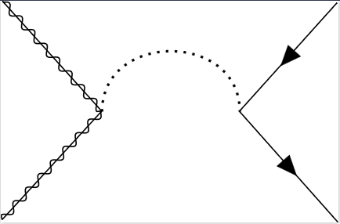

# TikzF_tool功能说明:
`    `TikzF_tool可以简化Tikz Fenyman这个Latex画费曼图的流程。由于Tikz Fenyman的原因，生成的图像与想要的费曼图只是具有相同的拓扑结构，想画出想要的费曼图还需要更多参数调整生成后的图像，这些都可以以在tex文件中完成。而TikzF_tool最终生成的就是一个tex文件。
# TikzF_tool打开方法:
`    `打开文件夹TikzF_tool运行Feynman_diagram就可以打开TikzF_tool的界面。在使用下面的代码打开TikzF_tool前，请确保您已经切换到Feynman_diagram所在路径。<br>
```bash
$ python3 feynman_diagram.py
```
成功打开后会弹出下面界面：<br>



# TikzF_tool使用方法:
1.输入起始点（建议以数字命名），不要输入a+数字的组合，因为输入数字得到的实际名称就是a+数字；<br>
2.选择方向，目前只有8种；<br>
3.输入起始点；<br>
4.选择线型，如果两点之间的线是弧形（目前只有半圆，1/4圆），在圈的下面选择对应的类型.basic line type为直线，half为半圆两者区别如下：<br>



注：<br>
名称选项是显示是显示图结构，它会输出所有节点以及边的名称。边的名称为l+数字，数字为几，改变对应边的代码就在\diagram*下面的第几行。<br>
生成的Latex代码的布局为spring layout。<br>
编译器目前只能选择lualatex。
# TikzF_tool按钮说明:
添加：添加特定边；<br>
删除：删除选中的边，支持多行选中；<br>
清除：删除全部边；<br>
保存：保存为tex文件。<br>
